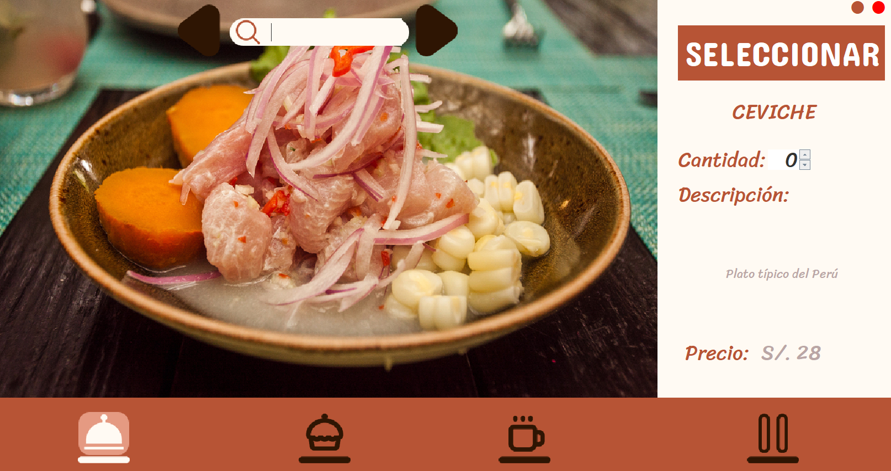

## SYSTERANT

  


This was a project developed in the first cycles of the university, it tried to offer a digital menu for restaurants, replacing the customer service, and facilitating the choice of products to the diner in a more dynamic way and that the dish can be previewed.

## 📱 Screenshots




## 📥 Technologies

This project is powered by:

- **Java** – The programming language used in the development.
- **Eclipse IDE** - It is necessary to use this ide to use the program, you can also use Apache Netbeans.

## ⚙️ Installation

```bash
git clone https://github.com/Luis3Fernando/Sub-Neteo
